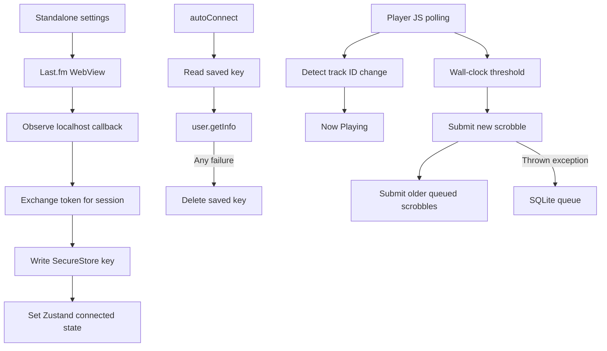

# Mobile standalone Last.fm: investigation and implementation plan

Research date: 2026-09-16. Reviewed checkout: `bc8d1f4`, application version `1.8.37-beta`. Scope: the mobile standalone client, with Android as the first device-validation target. No application behavior has been changed by this investigation.

**Assessment**

There are confirmed defects at several stages. The strongest explanations for losing a connection are destructive error handling during session restoration and an unmigrated SecureStore key rename. Connecting during playback does not activate the current play or flush the queue. Separately, the submission code silently treats Last.fm error responses as success, including when deleting queued scrobbles.

The blank login screen has identifiable UI weaknesses, but the actual duration and cause of the reported delay require device measurements. A restart is not intrinsically required by the code: an isolated reproduction shows that advancing to a different track after login can submit successfully. The plan therefore addresses the specific missing lifecycle transitions and does not assume that every post-login failure has the same cause.

| Reported symptom | Evidence | Confidence |
| --- | --- | --- |
| Blank or apparently stalled login screen | An opaque overlay hides the WebView until `onLoadEnd`; loading has no explanation, progress, deadline, retry, or error state. The callback is observed after navigation instead of being intercepted. | Code behavior confirmed; contribution of network, redirects, WebView startup and page rendering remains unmeasured. |
| Scrobbling appears to need a restart | Login updates the session and store, but never announces the current track or drains queued plays. Tracking may already consider the current track handled. | Missing activation reproduced; universal restart requirement disproved under mocked successful API responses. |
| Connection disappears over time | Any verification exception deletes the stored session, even a network failure. | Reproduced. |
| Connection disappears after an update | SecureStore key changed from `lastfm_session_key` to `lastfmSessionKey`; only a SQLite migration exists. | Exact historical change confirmed and failure reproduced. |
| Connected but no listening history appears | POST responses are parsed but their HTTP status, API errors and per-item acceptance are ignored. | Reproduced for invalid-session and ignored-scrobble responses. |

**Evidence and limits**

The investigation followed login navigation, token exchange, SecureStore restoration, SQLite migration, Zustand updates, player polling, foreground/background event handlers, queue storage, remote configuration and release history. Installed `@rntp/player` 5.9.2 source was inspected to avoid prescribing older Track Player APIs.

An isolated Node harness transpiled the actual `MobileScrobblerService.ts` and injected a clock, fetch, store, SecureStore and database mocks. All 12 checks reproduced their expected current behavior: 11 failure scenarios and one counterexample showing successful next-track scrobbling without restarting. These are research reproductions, not claims that the desired behavior passes. The harness did not contact a real Last.fm account, modify device credentials or measure native rendering.

The harness is available at [lastfm-research.mjs](C:/Users/eremef/.codex/visualizations/2026/09/16/01a0ab92-d3f7-7b72-8d1d-f5dd37bb964c/lastfm-research.mjs). Run it with Node and the repository root as its first argument. Native login timing, device background execution, actual Last.fm response samples and production APK upgrade behavior remain device acceptance work.

Baseline validation: `MobilePlayerService`, `TrackPlayerService` and `MobileAuthService` Jest suites all passed (3 suites, 63 tests). These suites do not cover the reproduced Last.fm defects. The initial sandboxed invocation failed with worker-process `EPERM`; the approved direct, in-band invocation completed its tests, then remained alive with Jest's open-asynchronous-handles warning and was interrupted. No application source files were changed. The plan is the only repository addition.

**Current execution path**

There is no activation edge from successful login to the player tracker or queue worker. There is also no queue drain triggered by startup, reconnect, foregrounding or enabling scrobbling.

The relevant state has four independent owners: the service holds session/user and track flags; SecureStore holds only a key; Zustand holds a separate connected/user snapshot; SQLite holds accountless pending submissions. The current design assumes these remain synchronized without a central transition mechanism.

**Detailed findings**

1. **Session verification turns temporary failures into permanent logout.**

   [loadSession and verifySession](D:/eremef/Documents/AI/antigravity/bandcamp-player/mobile/services/MobileScrobblerService.ts:48) read a key, call `user.getInfo`, and erase the key for any exception or response without `user`. DNS failure, offline launch, invalid JSON, server outage, rate limiting and actual revocation all take the same path. The harness reproduced deletion after a rejected fetch. No saved username is available for offline hydration. [autoConnect](D:/eremef/Documents/AI/antigravity/bandcamp-player/mobile/store/index.ts:765) awaits this network operation before publishing restored state; there is no request deadline.

   Last.fm sessions do not have a routine expiry requiring periodic login. They are indefinitely valid by default and can be revoked. This makes local deletion a much stronger explanation than ordinary token expiration. [Last.fm authentication specification](https://www.last.fm/api/authspec).

2. **An update left older secure credentials behind.**

   Commit `4dc427e` (2026-03-02) introduced SecureStore under `lastfm_session_key` and migrated the SQLite `lastfmSessionKey` setting. Commit `819009e` (2026-05-08) changed the SecureStore constant to `lastfmSessionKey` without a migration. The current loader never checks the older secure key. An affected user can therefore have a valid credential still on the device while the UI shows disconnected.

   Recovery must cover both secure names and the original SQLite setting. Explicit disconnect must remove all historical credentials too, or adding the missing migration could resurrect an account the user disconnected. If several credentials exist, migration must have deterministic precedence and must not silently switch accounts after a current credential is rejected.

3. **Successful login is not a playback lifecycle event.**

   [getSession](D:/eremef/Documents/AI/antigravity/bandcamp-player/mobile/services/MobileScrobblerService.ts:74) publishes internal session/user before awaiting the secure write. A failed write leaves the service connected in memory even though the screen reports no success. The login screen then sets Zustand directly. Neither operation informs the tracker.

   [handleProgressUpdate](D:/eremef/Documents/AI/antigravity/bandcamp-player/mobile/services/MobileScrobblerService.ts:148) records `currentTrackId` before authentication is available. Its initial Now Playing call returns early without a key. If the track reaches the threshold before login, it is queued and `hasScrobbled` becomes true. Logging in later does not resend Now Playing or drain that row. A different next track does start a new cycle; restart also resets the fields, explaining why it can appear to cure the problem.

   Immediate activation should mean that the currently playing track is announced promptly and eligible queued plays are submitted. A newly started track must still satisfy the listening requirement before becoming a historical scrobble.

4. **Login hides content and has incomplete callback/error handling.**

   [LastfmLoginScreen](D:/eremef/Documents/AI/antigravity/bandcamp-player/mobile/app/lastfm_login.tsx:13) starts with a loading overlay and covers all page content on every `onLoadStart`. The loading label appears only during token exchange. There are no `onError`, `onHttpError`, render-process failure or timeout/retry states. `onLoadEnd` is not evidence that usable login content was painted.

   The callback points to `http://localhost:26505/lastfm-callback`; the mobile flow has no listener at that address. Navigation observation may capture its token, but does not prevent the WebView from trying to load it. `startsWith` is an imprecise callback match. React state is not a synchronous mutual-exclusion lock, so closely spaced navigation events can attempt the same one-use token twice. Failures and missing tokens are logged, then the screen closes anyway. Closing the screen during exchange also does not cancel subsequent publication/navigation.

   WebView supports navigation interception, progress and error callbacks. The Android interception callback does not run on the initial load, so the existing entry URL must remain an allowed normal request. [React Native WebView reference](https://github.com/react-native-webview/react-native-webview/blob/master/docs/Reference.md).

5. **Submission success is not validated; queued history can be lost.**

   [postToLastfm](D:/eremef/Documents/AI/antigravity/bandcamp-player/mobile/services/MobileScrobblerService.ts:262) returns parsed JSON unconditionally. Callers discard it. The queue drain consequently deletes a row even when the server returns `{ error: 9 }`, an outage error, or an ignored item. The connection display remains unchanged. The harness reproduced both invalid-session and ignored-item deletion.

   The protocol exposes per-item acceptance and ignored reasons, and requires the original play-start timestamp. [track.scrobble documentation](https://www.last.fm/api/show/track.scrobble). Those fields must drive queue outcomes instead of assuming that a resolved fetch means success.

6. **The queue is neither durable before submission nor associated with an account.**

   [scrobble and submitPendingScrobbles](D:/eremef/Documents/AI/antigravity/bandcamp-player/mobile/services/MobileScrobblerService.ts:199) send a new play first, then older queued plays. Only thrown failures cause the new play to be persisted. A process exit during the request can lose it. Multiple drains can overlap and read the same rows. A database failure during a drain can also enter the outer catch after the new play was already accepted, creating a duplicate retry.

   [scrobble_queue](D:/eremef/Documents/AI/antigravity/bandcamp-player/mobile/services/MobileDatabase.ts:148) has no username, account identity, play identifier, attempt status or retry deadline. Plays are queued even without a connected account, including after explicit disconnect. A later account can receive somebody else's queued listening history. This is a confirmed design defect; actual cross-account submission was not performed.

7. **Listening accounting uses elapsed wall time instead of played time.**

   The `position` parameter is unused. Polling skips pauses, but the stored start time keeps aging, so resuming after a long pause can immediately qualify a barely played track. The same problem applies to buffering and time spent with scrobbling disabled or in another mode. The harness reproduced qualification at position 1 second after a 90-second gap.

   A repeat or replay of the same track ID never resets `hasScrobbled`. Tracks lasting 30 seconds or less are not excluded. The timestamp is generated at submission rather than play start. Flags are set before durable enqueue completes, so a rejected database write has no safe retry boundary.

   The required eligibility rule is a duration greater than 30 seconds and listening for half the duration or four minutes, whichever is sooner. Cached submissions should survive restarts and precede new ones. [Last.fm scrobbling guide](https://www.last.fm/api/scrobbling).

8. **Background delivery has no scrobbling integration.**

   The only caller is [MobilePlayerService polling](D:/eremef/Documents/AI/antigravity/bandcamp-player/mobile/services/MobilePlayerService.ts:150), a 250 ms JS timer throttled to update once per second. [TrackPlayerService](D:/eremef/Documents/AI/antigravity/bandcamp-player/mobile/services/TrackPlayerService.ts:165) handles native events but no progress event for scrobbling. [player setup](D:/eremef/Documents/AI/antigravity/bandcamp-player/mobile/services/player.ts:5) does not enable native progress synchronization.

   Installed RNTP 5.9.2 exposes `progressSync.intervalSeconds` and `Event.PlaybackProgressUpdated` with `mediaId`, position, duration and a millisecond timestamp. Its Android background handler has an approximately five-second execution window. The native event broker explicitly does not start a cold React context. iOS background handling uses ordinary event listeners and requires the audio background capability. These are local dependency facts, not a claim that background loss was reproduced on a device.

9. **Uncoordinated asynchronous work can overwrite newer authentication.**

   The service has no initialization promise, generation counter or cancellation guard. The harness reproduced an older verification request failing after a new login and deleting the newly saved session. Concurrent callback exchange, restore, disconnect and account replacement therefore need one lifecycle owner. Merely adding a spinner or a store subscription will not solve this.

10. **Other update/configuration explanations have narrower evidence.**

    A historical rebrand (`56d90f8`, 2026-02-26) changed the application identifier. That is a separate app storage boundary, not an ordinary upgrade of the same installed app. SecureStore is designed to persist through updates; Android uninstall/reinstall is different, and restored backups cannot recover deleted keystore material. The current manifest already references SecureStore backup exclusions. [Expo SDK 56 SecureStore documentation](https://docs.expo.dev/versions/v56.0.0/sdk/securestore/).

    API credentials and endpoints are read dynamically from remote configuration. A config change during a login flow could mismatch the credentials used for authorization and exchange. Local history shows no Last.fm credential change after initial introduction, so rotation is a risk to guard, not an established incident cause. The tracked Gradle version metadata also differs from app config, while release CI runs Expo prebuild and injects release signing. Inspect the generated APK before concluding that the shipped build has the tracked-file values.

**Implementation contracts**

The implementation should have one service-owned public state, mirrored into Zustand by subscription. Keep mobile-specific state local initially; the shared `LastfmState` is also consumed by desktop code and should not be expanded casually.

| Concern | Proposed invariant |
| --- | --- |
| Credentials | Network errors never delete credentials. Only explicit disconnect or a classified invalid-session result for the current session changes authorization. |
| State publication | Connected is published only after durable persistence; stale async operations cannot overwrite a newer connection or disconnect. |
| Startup | Local hydration does not wait for Last.fm availability. Missing profile metadata does not imply a missing key. |
| Listening | Eligibility uses measured playing intervals for one play occurrence; pause, seek, buffering, mode switches and opt-out do not fabricate listening. |
| Queue | Each eligible play is persisted once locally before network submission and belongs to one account. |
| Delivery | A row leaves pending state only after an explicit accepted or classified terminal outcome. A timeout is not proof of rejection or acceptance. |
| Privacy | Explicit disconnect stops new collection and invalidates in-flight work; unowned legacy rows are never silently assigned to the next account. |

Assumptions to verify are: authentication token delivery occurs through a supported callback; the app's current API identity is stable; native events identify the actual item rather than a stale UI track; the installed app keeps its storage identity on update; and the runtime remains available while background audio is expected to continue. Transport, provider payloads, native event ordering and storage failures are all treated as fallible inputs.

Recommended public state separates `sessionStatus` (`loading`, `disconnected`, `connected`, `reconnect-required`, `storage-error`) from `deliveryStatus` (`idle`, `sending`, `offline`, `retrying`, `configuration-error`). Include user, verification status, pending count, last accepted submission time and a sanitized last error. Temporary delivery failures must not show a misleading Disconnect/Connect cycle.

**Ordered implementation work**

**Phase 0 — Capture the baseline and add targeted regressions.**

Add mobile Jest suites for the scrobbler, login screen and migration, converting the research scenarios into desired-behavior tests. Reset singleton state, timers, fake clocks, mock storage and Zustand between tests. Capture a release-build device trace for opening settings, tapping Connect, first usable Last.fm content, callback arrival, token exchange, durable save and first submission attempt. Record elapsed durations and coarse request outcomes, never credentials, token query strings, signatures, cookies or full response bodies.

Use the existing MobileLoggerService and LogsModal for diagnostic export; no new analytics service is necessary. Record the actual installed package, version/build, Android/System WebView version, network type and installation path. This resolves the outstanding blank-screen latency and upgrade ambiguity.

**Phase 1 — Introduce a typed Last.fm transport and stop destructive recovery.**

Create a mobile `lastfm-api-client.ts` used by restore, exchange, Now Playing and submissions. Parse responses as `unknown`, validate method-specific success shapes, and classify HTTP/transport errors separately from Last.fm errors. Keep URL encoding and signature generation in one place; exclude signature/format/callback parameters from the signature input as required. Snapshot one coherent API configuration for each authentication attempt and session request.

| Outcome | Planned behavior |
| --- | --- |
| Network failure, timeout, non-JSON gateway response, HTTP 5xx, API 11/16 | Preserve session and queued plays; retry with backoff. |
| API 9 for the current session/configuration | Stop authenticated delivery, publish reconnect-required, preserve account-owned pending plays. Ignore stale responses from previous generations. |
| API 10/13/26 | Report configuration/signature/application-key failure; do not erase the user's credential or loop through login. |
| API 29 or HTTP 429 | Cool down the worker; honor Retry-After when present. This is a conservative scheduling policy based on the method's rate-limit classification. |
| Token errors 4/14/15 | Keep an actionable login state: invalid, not yet authorized, or expired. Never describe these as revocation of an existing session. |
| Valid acceptance | Acknowledge only the corresponding queue rows. |
| Ignored item | Record its reason separately from accepted history. Quarantine terminal metadata/old-time failures; pause daily-limit rows and review future-time rows without tight retries. |
| Malformed or unknown result | Preserve pending data, record a bounded diagnostic, stop repeated immediate attempts. |

These distinctions follow the endpoint error definitions; the retry schedule is an application design choice. [auth.getSession errors](https://www.last.fm/api/show/auth.getSession), [track.scrobble response and errors](https://www.last.fm/api/show/track.scrobble).

Use a bounded foreground timeout, initially 15 seconds, and capped exponential retry with jitter. Apply a shorter total budget to background work. Do not retry historical Now Playing requests; send a fresh current-state notification only on a meaningful playback/authentication transition. Do not automatically replay a one-use token after an ambiguous exchange timeout: retain a received session for a storage-only retry, or start a new authorization if the response was lost.

As an early patch, change verification so temporary failures retain the key. Invalid-session handling must use the captured session generation, not whichever key happens to be stored when the request finishes.

**Phase 2 — Repair migration and centralize session lifecycle.**

Add a storage adapter and a service `initialize()` promise shared by all callers. Proposed canonical record: a versioned SecureStore value under `lastfmSession.v1`, containing the session key, username/profile snapshot when known, API credential identity and save time. Never place the session key in Zustand or SQLite. This is a deliberate migration, not another unhandled rename.

Read in this order: canonical record; current raw SecureStore `lastfmSessionKey`; historical SecureStore `lastfm_session_key`; original SQLite `lastfmSessionKey`. Validate shape and choose once. For legacy key-only records, allow an unknown profile during offline hydration and fetch the authenticated profile later. Do not substitute a public username lookup as proof that the key works: `user.getInfo` should use the session with no explicit username. [user.getInfo parameters](https://www.last.fm/api/show/user.getInfo).

Persist and read back the canonical record before removing obsolete values. A failed write/read must leave source credentials recoverable. Record migration completion; handle partial migration idempotently. Explicit disconnect must serialize against login/restore, clear all secure aliases and the SQLite alias, and invalidate pending callbacks. A disconnect interrupted during cleanup must not be followed by automatic legacy fallback; persist a disconnect/migration tombstone before cleanup and honor it on next boot.

Use a monotonically increasing operation generation for restore, verify, connect and disconnect. Capture the generation and credential identity before each await; publish or invalidate only if still current. Commit durable session data before broadcasting Connected. If saving fails after token exchange, keep the received session only in a protected in-memory retry state and offer Save again without exchanging the token twice.

Hydrate locally during application initialization. Move network verification out of the blocking `autoConnect()` path. Cache the profile, preserve it during outages, and make verification opportunistic on startup/foreground with backoff. Existing sessions already erased cannot be recovered unless another legacy copy remains; prompt for login once in that case. Downgrading to a build that understands only raw legacy keys may require reconnection; document this limitation rather than retaining contradictory account aliases indefinitely.

**Phase 3 — Make login visible, cancellable and immediately effective.**

Keep the existing WebView flow for the first repair, minimizing authentication infrastructure changes. Introduce explicit phases: opening page, awaiting authorization, exchanging token, saving session, success, recoverable failure and cancellation. Show a loading label immediately. Once usable content is visible, use an unobtrusive progress indicator instead of covering the page for every subsequent resource load. Add a bounded page-load failure state with Retry and Cancel; base first-content handling on measured WebView behavior rather than an arbitrary progress percentage.

Intercept the exact callback origin and path with `onShouldStartLoadWithRequest`, capture the token and return false. Retain a deduplicated navigation fallback where necessary. Use a synchronous ref/attempt lock plus the service generation guard. Freeze the authorization URL/configuration for the attempt. Validate the token and callback; ignore unrelated navigation. Add explicit WebView network/HTTP/process failure handling. Navigate back only after durable connection succeeds; leave failures on screen with a useful message. Cancellation or unmount invalidates the attempt and prevents late navigation.

After connection, call a single activation method that publishes state, samples the active native track and sends a fresh Now Playing if appropriate. It also schedules pending owned plays for delivery when standalone mode and the user's scrobbling preference permit. It must not force the toggle on or fake an immediate historical scrobble. For a first-time connection during a track, begin eligible listening at connection; for reauthentication to the same account, preserve already recorded eligible listening and pending history.

Evaluate a system-browser flow only if device measurements show persistent WebView problems or login compatibility issues. `expo-web-browser` is already installed. `openAuthSessionAsync` needs a working redirect into the app; a localhost callback intercepted inside a WebView does not become a functioning system-browser callback automatically. Confirm Last.fm callback acceptance before proposing a custom scheme or an HTTPS relay. [Expo WebBrowser documentation](https://docs.expo.dev/versions/latest/sdk/webbrowser/).

An alternative feasibility spike can evaluate Last.fm's pre-issued request-token browser authorization followed by exchange on return. Its documentation is presented for desktop applications, so validate suitability and current provider behavior before adopting it on mobile. Do not collect Last.fm passwords in the application. [Last.fm browser/token flow](https://www.last.fm/api/desktopauth).

**Phase 4 — Replace opportunistic retries with a durable, account-owned queue.**

Migrate the queue additively. Add `play_id` with a unique constraint, account identity, `started_at`, attempt count, next-attempt time, status and last failure/ignored code. Account identity should include normalized username and the relevant API application identity; do not use the session secret as a database identifier. Use a stable secondary ordering key for equal timestamps.

Persist eligibility before calling the network. Use one serialized drain per JS runtime and confirm whether any platform can open an independent competing runtime; use transactional claims/leases if needed. Drain oldest-first in bounded batches of at most 50. Keep request identity stable on retry. Snapshot the current account/generation for each batch so an account switch cannot redirect old rows or apply stale results to a new account.

Trigger delivery on successful login/reauthentication, initialization after local hydration, app foreground, connectivity restoration, enabling scrobbling, entering standalone mode, a new eligible play and retry expiry while the runtime is active. Installed Expo Network 56.0.5 exposes `addNetworkStateListener`; use that adapter and dispose its subscription correctly. Connectivity is a scheduling hint, not proof that Last.fm is reachable. Do not depend on a timer surviving process suspension; persisted deadlines are checked on the next valid wakeup.

Default account policy: do not collect before the first connection or after explicit disconnect. Preserve owned rows across temporary disconnection and reauthentication. Pause pending submissions while disabled or in remote mode. On explicit disconnect, clear that account's pending plays after the disconnect tombstone is durable. Quarantine existing accountless rows and offer discard or explicit assignment; never silently send them to the next user.

Retain accepted/terminal outcomes for a bounded diagnostic period, then prune with a documented retention policy. Pending rows should not vanish silently when a limit is reached. Local unique play IDs prevent repeated local enqueue, but Last.fm has no client idempotency key in the documented submission contract: a timeout after server acceptance remains an ambiguous delivery. Preserve the original timestamp and describe delivery as retryable, not guaranteed exactly once.

**Phase 5 — Track play occurrences through native playback events.**

Create a small playback tracker separated from transport. Its record contains play ID, native queue/media identity, track metadata, account identity, original wall-clock start, accumulated listened seconds, last progress/state checkpoint and eligibility/enqueue state. Queue item identity alone is insufficient because repeat-one reuses it; every real playback occurrence needs a new play ID.

Enable RNTP 5.9.2 native progress events with `progressSync: { intervalSeconds: 1 }` as an initial correctness setting, then measure battery impact. Route progress, native playing state and media transitions through one adapter in both foreground listeners and the Android background handler. Use the native event's media identity to resolve metadata; do not attribute delayed samples to `store.currentTrack`. Remove the scrobbler call from the UI polling path once the native path is established, or deduplicate deliberately during rollout.

Accumulate only validated playing intervals, using monotonic elapsed time and plausible position deltas. Explicit seek actions reset the sample baseline; large unexplained jumps must not add skipped time. Freeze on pause, buffering, disabled scrobbling and leaving standalone mode. Preserve elapsed listening when resuming the same authorized play. Recognize repeat/replay from native transitions and reset boundaries; verify native repeat behavior because the exposed transition payload has no reason field. Do not mistake every backwards seek for a new play.

Require finite positive duration, the minimum duration rule and useful metadata. Use the initial play-start timestamp for submission. Persist a checkpoint on meaningful events and periodically while playing, with an explicit bounded-loss budget such as one progress interval for active observation and a short checkpoint window for abrupt termination. On ordinary restart, resume a compatible checkpoint rather than recreating an already queued play. Do not infer that music kept playing throughout an unobserved process gap.

Native callbacks must await durable checkpoint/enqueue work. Keep an Android background event's total work within its approximately five-second budget; avoid starting a 15-second fetch there. Run a short bounded delivery attempt only if time remains, otherwise retain the row for the next event/foreground. Full cold-process continuation is a separate native-runtime question: the installed library does not automatically start React for that case. Preserve current task-removal playback semantics and test them explicitly.

**Phase 6 — Expose useful status and validate the release path.**

Settings should distinguish Connected, Scrobbling off, Waiting for network, pending submissions, application configuration error and Reconnect required. Show the last accepted scrobble time and a manual Retry when useful. Do not present parsed-but-rejected requests as activity. Keep diagnostics bounded and redact tokens/keys before messages reach MobileLoggerService.

Validate upgrades using two actual release APKs with the same package/signing identity and no uninstall. Inspect the merged backup rules and APK metadata produced by CI. Include legacy secure-key and SQLite fixtures, offline first launch, account replacement and interrupted migration. Treat a changed package, cleared app data, Android reinstall or provider revocation as a different scenario with an explanatory reconnect flow. Android updates require compatible application/signing identity. [Android app signing documentation](https://developer.android.com/studio/publish/app-signing).

**File and test map**

| Area | Existing files | Planned additions / checks |
| --- | --- | --- |
| Transport and session | `mobile/services/MobileScrobblerService.ts` | `lastfm-api-client.ts`, `lastfm-session-storage.ts`; transport/session unit suites. |
| Login | `mobile/app/lastfm_login.tsx` | `mobile/__tests__/app/lastfm_login.test.tsx`; lifecycle, duplicate navigation, error and cancellation cases. |
| State and startup | `mobile/store/index.ts`, `mobile/app/_layout.tsx`, `mobile/app/settings.tsx` | Mobile-specific state types; service subscription, offline hydration and status tests. |
| Durable delivery | `mobile/services/MobileDatabase.ts` | `lastfm-outbox.ts`; migration, ordering, account isolation and concurrent-drain tests. |
| Listening | `mobile/services/MobilePlayerService.ts`, `mobile/services/TrackPlayerService.ts`, `mobile/services/player.ts`, `mobile/index.js` | `lastfm-playback-tracker.ts`; native adapter and accounting tests. |
| Diagnostics/release | `mobile/services/MobileLoggerService.ts`, `mobile/app.config.js`, `.github/workflows/release.yml` | Redaction checks and documented physical-device upgrade matrix. |

Use ESM imports, repository formatting and narrowed unknown responses. Keep tests in `mobile/__tests__/`. Preserve desktop/remote behavior; if shared types or configuration change, run their desktop checks too. Avoid a dependency upgrade as an incidental part of this fix; existing Expo, SecureStore, WebView and RNTP capabilities should cover the initial design.

**Acceptance matrix**

| Scenario | Required result |
| --- | --- |
| Fresh login, idle player | Visible loading/error states; one exchange; durable connected state; no fabricated play. |
| Login during playback | Current Now Playing attempted within two seconds after durable save under a healthy local runtime; eligible history follows listening policy without restart. |
| Repeat callback events | Exactly one token exchange and one navigation completion. |
| Cancel while page/exchange/save is pending | No late reconnection or navigation from the cancelled attempt. |
| Offline startup / DNS failure / timeout / 5xx / malformed response | Saved credentials remain; application startup and local playback continue. |
| Actual invalid session | Reconnect-required state; owned queue retained; no repeated authenticated request loop. |
| API-key/signature error | Configuration failure displayed separately from user logout. |
| Each historical credential source and both secure keys present | Deterministic, recoverable migration with no unintended account switch. |
| Storage read/write/delete error; process exit between migration steps | No silent success, lost source credential or resurrection after disconnect. |
| Verification completes after login or disconnect | Stale result cannot change the new session state. |
| Queue retry under 200+API-error, 429, timeout and partial batch acceptance | No silent loss; only classified outcomes acknowledged; bounded retry. |
| Network restored with player paused | Existing eligible rows can drain without playing a new track. |
| Two flush triggers overlap | No concurrent submission of the same local row. |
| Account A disconnects and B connects | B never receives A's plays or accountless legacy rows automatically. |
| Pause/buffer/seek/disable/mode switch | Unplayed elapsed time does not count. |
| Duration 20, 30, 31, 120 and 600 seconds | Boundary behavior follows the eligibility rule, with bounded sample tolerance. |
| Repeat-one, same track twice in queue, replay after stop | One eligible submission per actual play occurrence. |
| Screen locked for several tracks | Native events maintain accounting and durable delivery without the UI timer. |
| Foreground/background overlap and delayed native samples | No duplicated play or attribution to the wrong track. |
| Process interruption / task removal | Durable queued plays survive; no invented playback during an unobserved gap. |
| Normal release update, offline first start | Credentials and pending history survive without login. |
| Android reinstall / changed application identity | Clear reconnect behavior; no misleading promise of preserved secure storage. |
| Remote mode | Mobile does not independently collect or submit the desktop's playback. |

For live acceptance, use a dedicated test account, one identifiable short album, real foreground and screen-off playback, and inspect Last.fm history. Record attempted, accepted, ignored and pending separately. API response acceptance and profile-page display timing are different measurements.

Run targeted Jest suites first, followed by `npm run lint:mobile`, `npm run test:mobile -- --runInBand` where argument forwarding works, and `npm run typecheck --prefix mobile`. On this Windows setup, direct invocation of `mobile/node_modules/jest/bin/jest.js` with explicit flags avoids npm forwarding ambiguity. Run desktop lint/typecheck/tests if shared files change. Jest cannot replace release APK login, screen-off and upgrade checks.

**Delivery sequence and completion criteria**

Implement the transport/error classification and recoverable credential migration first. Follow with the session lifecycle and login activation/UI repair. Then ship the account-owned durable queue together with corrected playback accounting and native event integration; shipping one while leaving the other untouched would still misreport or lose listening history. Finish with diagnostics and release-device validation.

The first small release can safely target retained credentials, legacy-key recovery, guarded login activation and visible login errors, provided rejected requests are preserved rather than discarded. The complete reliability change is ready only when the acceptance matrix passes, a same-identity APK upgrade retains the connection, and foreground/background playback works without a restart. Remaining uncertainties are device timing and runtime behavior, not whether the reproduced service defects exist.
