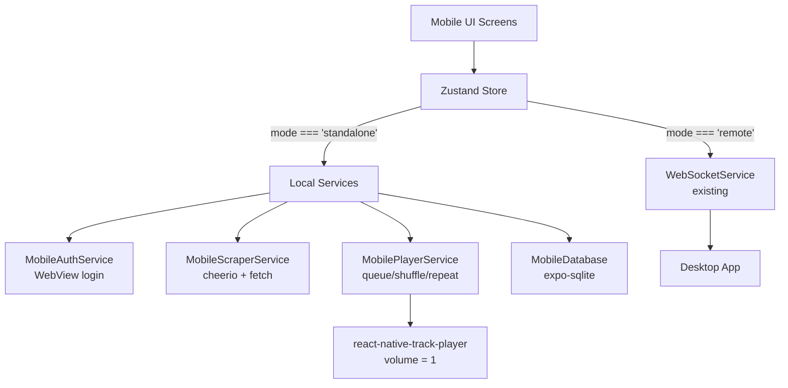

# Independent Mobile Player — Detailed Implementation Plan

The mobile app is currently a **pure remote controller** — every action forwards to the desktop via WebSocket. This plan adds an **optional standalone mode** where the mobile app scrapes Bandcamp directly, manages its own queue/playlists, and streams audio natively. The existing remote mode remains untouched.

> [!IMPORTANT]
> **Biggest risk:** Bandcamp scraping from a mobile device. The scraper uses `axios` + `cheerio`, both of which work in React Native. However, Bandcamp may behave differently (cookie handling, rate limiting, User-Agent) on mobile. **Phase 2 includes a spike to validate this before we build everything else on top.**

## Architecture Overview



> [!NOTE]
> **Dual-mode design:** Each store action checks [get().mode](file:///d:/eremef/Documents/AI/antigravity/Bandcamp-player/src/main/services/auth.service.ts#143-152) and either sends a WebSocket message (remote) or calls a local service (standalone). The UI screens do NOT change — they call the same store methods regardless of mode.

---

## Proposed Changes

### Phase 1: Core Infrastructure — Mode System & Database

Goal: Establish the mode toggle and local SQLite database before any feature work.

---

#### [NEW] [MobileDatabase.ts](file:///d:/eremef/Documents/AI/antigravity/Bandcamp-player/mobile/services/MobileDatabase.ts)

Local SQLite database for standalone mode. Uses `expo-sqlite` (already in Expo SDK, just needs installation).

**Tables:** `collection_cache`, `playlists`, `playlist_tracks`, `artists`, `settings`
Mirror the desktop [database.ts](file:///d:/eremef/Documents/AI/antigravity/Bandcamp-player/src/main/database/database.ts) schema but using `expo-sqlite` async API instead of `better-sqlite3`.

**Key methods:**

- [getCollectionCache(userId)](file:///d:/eremef/Documents/AI/antigravity/Bandcamp-player/src/main/database/database.ts#476-480) / [saveCollectionCache(userId, data)](file:///d:/eremef/Documents/AI/antigravity/Bandcamp-player/src/main/database/database.ts#481-488)
- [getAllPlaylists()](file:///d:/eremef/Documents/AI/antigravity/Bandcamp-player/src/main/database/database.ts#176-207) / [createPlaylist()](file:///d:/eremef/Documents/AI/antigravity/Bandcamp-player/mobile/store/index.ts#366-367) / [deletePlaylist()](file:///d:/eremef/Documents/AI/antigravity/Bandcamp-player/mobile/store/index.ts#368-369) / [addTrackToPlaylist()](file:///d:/eremef/Documents/AI/antigravity/Bandcamp-player/src/main/database/database.ts#293-308)
- [getArtists()](file:///d:/eremef/Documents/AI/antigravity/Bandcamp-player/src/main/database/database.ts#537-553) / [replaceArtists()](file:///d:/eremef/Documents/AI/antigravity/Bandcamp-player/src/main/database/database.ts#514-536)
- [getSettings()](file:///d:/eremef/Documents/AI/antigravity/Bandcamp-player/src/main/database/database.ts#159-163) / [setSettings()](file:///d:/eremef/Documents/AI/antigravity/Bandcamp-player/src/main/database/database.ts#164-173)

---

#### [MODIFY] [package.json](file:///d:/eremef/Documents/AI/antigravity/Bandcamp-player/mobile/package.json)

Add new dependencies:

- `expo-sqlite` — local database
- `expo-web-browser` — for OAuth/WebView login flows
- `expo-secure-store` — secure cookie storage
- `cheerio` + `react-native-url-polyfill` — HTML parsing (same lib as desktop)

---

#### [MODIFY] [store/index.ts](file:///d:/eremef/Documents/AI/antigravity/Bandcamp-player/mobile/store/index.ts)

Add mode state and switching:

```typescript
// New state fields
mode: 'remote' | 'standalone';  // default: 'remote'
setMode: (mode: 'remote' | 'standalone') => Promise<void>;
auth: { isAuthenticated: boolean; user: BandcampUser | null };

// New standalone-only actions
loginBandcamp: () => Promise<void>;
logoutBandcamp: () => Promise<void>;
```

Every existing action (e.g., [play()](file:///d:/eremef/Documents/AI/antigravity/Bandcamp-player/mobile/store/index.ts#193-194), [refreshCollection()](file:///d:/eremef/Documents/AI/antigravity/Bandcamp-player/mobile/store/index.ts#370-395)) gets a mode check:

```typescript
play: () => {
    if (get().mode === 'remote') {
        webSocketService.send('play');
    } else {
        mobilePlayerService.play();
    }
},
```

---

### Phase 2: Authentication — WebView Login & Cookie Storage

Goal: Let the user log in to Bandcamp from the mobile app and persist cookies for scraping.

---

#### [NEW] [MobileAuthService.ts](file:///d:/eremef/Documents/AI/antigravity/Bandcamp-player/mobile/services/MobileAuthService.ts)

Replaces the desktop's [AuthService](file:///d:/eremef/Documents/AI/antigravity/Bandcamp-player/src/main/services/auth.service.ts) (which depends on Electron's [Session](file:///d:/eremef/Documents/AI/antigravity/Bandcamp-player/src/main/services/auth.service.ts#21-46) and `BrowserWindow`).

**Approach:** Use React Native's `react-native-webview` to load `https://bandcamp.com/login`. Intercept cookies after successful login using `onNavigationStateChange`. Store cookies in `expo-secure-store`.

**Key methods:**

- [login(): Promise<AuthState>](file:///d:/eremef/Documents/AI/antigravity/Bandcamp-player/src/main/services/auth.service.ts#47-125) — opens WebView, returns user info after login
- [checkSession(): Promise<AuthState>](file:///d:/eremef/Documents/AI/antigravity/Bandcamp-player/src/main/services/auth.service.ts#21-46) — validates stored cookies
- [getSessionCookies(): Promise<string>](file:///d:/eremef/Documents/AI/antigravity/Bandcamp-player/src/main/services/auth.service.ts#302-312) — returns cookie header string for HTTP requests
- [logout(): Promise<void>](file:///d:/eremef/Documents/AI/antigravity/Bandcamp-player/src/main/services/auth.service.ts#126-142) — clears stored cookies
- `fetchUserFromCookies(): Promise<BandcampUser | null>` — parses identity cookie (same logic as desktop's [fetchUserFromSession](file:///d:/eremef/Documents/AI/antigravity/Bandcamp-player/src/main/services/auth.service.ts#L153-L209))

**Differences from desktop:**

- No `net.request` — use [fetch](file:///d:/eremef/Documents/AI/antigravity/Bandcamp-player/src/main/services/scraper.service.ts#179-374) or `axios` for the menubar API call to get profile info
- Cookies stored in `expo-secure-store` instead of Electron session
- Login uses a WebView screen instead of `BrowserWindow`

---

#### [NEW] [BandcampLogin.tsx](file:///d:/eremef/Documents/AI/antigravity/Bandcamp-player/mobile/app/bandcamp_login.tsx)

New Expo Router screen with a WebView pointing to `https://bandcamp.com/login`. Monitors navigation for successful login redirect. Extracts cookies and calls `MobileAuthService.saveCookies()`.

---

#### [MODIFY] [index.tsx](file:///d:/eremef/Documents/AI/antigravity/Bandcamp-player/mobile/app/index.tsx)

Update the connect screen to offer two modes:

1. **Remote** (existing) — enter IP, connect via WebSocket
2. **Standalone** — log in to Bandcamp directly, no desktop required

The UI shows a toggle/segmented control at the top. In standalone mode, shows a "Login to Bandcamp" button instead of the IP input.

---

### Phase 3: Scraper Service — Port to React Native

Goal: Extract Bandcamp data (collection, albums, radio) directly from the mobile app.

---

#### [NEW] [MobileScraperService.ts](file:///d:/eremef/Documents/AI/antigravity/Bandcamp-player/mobile/services/MobileScraperService.ts)

Port of the desktop's [ScraperService](file:///d:/eremef/Documents/AI/antigravity/Bandcamp-player/src/main/services/scraper.service.ts) (913 lines).

**What stays the same:**

- All HTML parsing logic (`cheerio.load()`, [extractJsonObject()](file:///d:/eremef/Documents/AI/antigravity/Bandcamp-player/src/main/services/scraper.service.ts#87-173), [parseCollectionItem()](file:///d:/eremef/Documents/AI/antigravity/Bandcamp-player/src/main/services/scraper.service.ts#489-546), [parseCollectionItemFromDOM()](file:///d:/eremef/Documents/AI/antigravity/Bandcamp-player/src/main/services/scraper.service.ts#547-603))
- Collection fetching flow (initial page scrape → API pagination)
- Album detail fetching ([getAlbumDetails()](file:///d:/eremef/Documents/AI/antigravity/Bandcamp-player/src/main/services/scraper.service.ts#604-678))
- Radio station fetching ([getRadioStations()](file:///d:/eremef/Documents/AI/antigravity/Bandcamp-player/src/main/services/scraper.service.ts#702-743) — public API, no auth needed)
- Collection search ([searchCollection()](file:///d:/eremef/Documents/AI/antigravity/Bandcamp-player/src/main/services/scraper.service.ts#744-775))
- Artist extraction ([extractAndSaveArtists()](file:///d:/eremef/Documents/AI/antigravity/Bandcamp-player/src/main/services/scraper.service.ts#391-434), [consolidateArtistIds()](file:///d:/eremef/Documents/AI/antigravity/Bandcamp-player/src/main/services/scraper.service.ts#776-825))
- Title/artist cleaning helpers ([cleanTitle()](file:///d:/eremef/Documents/AI/antigravity/Bandcamp-player/src/main/services/scraper.service.ts#47-86), [cleanArtistName()](file:///d:/eremef/Documents/AI/antigravity/Bandcamp-player/src/main/services/scraper.service.ts#34-46))

**What changes:**

| Desktop | Mobile |
|---------|--------|
| `axios` with node headers | [fetch](file:///d:/eremef/Documents/AI/antigravity/Bandcamp-player/src/main/services/scraper.service.ts#179-374) or `axios` (RN-compatible) |
| `this.authService.getSessionCookies()` | `MobileAuthService.getSessionCookies()` |
| `this.database?.saveCollectionCache()` | `MobileDatabase.saveCollectionCache()` |
| `simulationService` references | Remove (not needed on mobile) |
| `EventEmitter` | Zustand store updates or RN `EventEmitter` |
| `new Function(...)` for JSON parsing | Remove (security risk on mobile, use try/catch JSON.parse only) |

**Shared code opportunity:** The pure parsing functions ([cleanTitle](file:///d:/eremef/Documents/AI/antigravity/Bandcamp-player/src/main/services/scraper.service.ts#47-86), [cleanArtistName](file:///d:/eremef/Documents/AI/antigravity/Bandcamp-player/src/main/services/scraper.service.ts#34-46), [extractJsonObject](file:///d:/eremef/Documents/AI/antigravity/Bandcamp-player/src/main/services/scraper.service.ts#87-173), [parseCollectionItem](file:///d:/eremef/Documents/AI/antigravity/Bandcamp-player/src/main/services/scraper.service.ts#489-546), [parseCollectionItemFromDOM](file:///d:/eremef/Documents/AI/antigravity/Bandcamp-player/src/main/services/scraper.service.ts#547-603), [consolidateArtistIds](file:///d:/eremef/Documents/AI/antigravity/Bandcamp-player/src/main/services/scraper.service.ts#776-825)) could be extracted to `src/shared/scraper-utils.ts` and imported by both desktop and mobile. This avoids duplicating ~300 lines of parsing logic. However, this requires updating the mobile's [metro.config.js](file:///d:/eremef/Documents/AI/antigravity/Bandcamp-player/mobile/metro.config.js) to resolve the shared module path (already done for `@shared/types`).

---

#### [NEW] [shared/scraper-utils.ts](file:///d:/eremef/Documents/AI/antigravity/Bandcamp-player/src/shared/scraper-utils.ts) *(optional, recommended)*

Extract pure parsing functions from [ScraperService](file:///d:/eremef/Documents/AI/antigravity/Bandcamp-player/src/main/services/scraper.service.ts#14-913) that have no Electron/Node dependencies:

- [cleanArtistName(name)](file:///d:/eremef/Documents/AI/antigravity/Bandcamp-player/src/main/services/scraper.service.ts#34-46)
- [cleanTitle(rawTitle, artist)](file:///d:/eremef/Documents/AI/antigravity/Bandcamp-player/src/main/services/scraper.service.ts#47-86)
- [extractJsonObject(content, keys)](file:///d:/eremef/Documents/AI/antigravity/Bandcamp-player/src/main/services/scraper.service.ts#87-173) (without `new Function`)
- [parseCollectionItem(item)](file:///d:/eremef/Documents/AI/antigravity/Bandcamp-player/src/main/services/scraper.service.ts#489-546) — accepts raw API item, returns [CollectionItem](file:///d:/eremef/Documents/AI/antigravity/Bandcamp-player/src/shared/types.ts#49-57)
- [parseCollectionItemFromDOM($, $item)](file:///d:/eremef/Documents/AI/antigravity/Bandcamp-player/src/main/services/scraper.service.ts#547-603) — accepts cheerio objects
- [consolidateArtistIds(items)](file:///d:/eremef/Documents/AI/antigravity/Bandcamp-player/src/main/services/scraper.service.ts#776-825)
- [searchCollection(cachedCollection, query)](file:///d:/eremef/Documents/AI/antigravity/Bandcamp-player/src/main/services/scraper.service.ts#744-775)

The desktop [ScraperService](file:///d:/eremef/Documents/AI/antigravity/Bandcamp-player/src/main/services/scraper.service.ts#14-913) would import these instead of having them as private methods.

---

### Phase 4: Local Player Service — Queue, Shuffle, Repeat

Goal: Manage playback state locally instead of relying on the desktop.

---

#### [NEW] [MobilePlayerService.ts](file:///d:/eremef/Documents/AI/antigravity/Bandcamp-player/mobile/services/MobilePlayerService.ts)

Port of the desktop's [PlayerService](file:///d:/eremef/Documents/AI/antigravity/Bandcamp-player/src/main/services/player.service.ts) (694 lines), adapted for `react-native-track-player`.

**Key differences from desktop:**

| Desktop [PlayerService](file:///d:/eremef/Documents/AI/antigravity/Bandcamp-player/src/main/services/player.service.ts#14-694) | Mobile `MobilePlayerService` |
|------------------------|------------------------------|
| Electron audio element | `react-native-track-player` |
| [CacheService](file:///d:/eremef/Documents/AI/antigravity/Bandcamp-player/src/main/services/cache.service.ts#12-249) for offline | Not in v1 (future enhancement) |
| `ScrobblerService` | Not in v1 |
| `CastService` | Not in v1 |
| `EventEmitter` events → IPC | Direct Zustand store updates |
| Time tracking via custom interval | `TrackPlayer.getProgress()` + `Event.PlaybackProgressUpdated` |

**Methods to implement:**

- [play(track?)](file:///d:/eremef/Documents/AI/antigravity/Bandcamp-player/mobile/store/index.ts#193-194) — loads track into TrackPlayer at **volume 1** (unlike remote mode's volume 0)
- [pause()](file:///d:/eremef/Documents/AI/antigravity/Bandcamp-player/mobile/store/index.ts#194-195) / [stop()](file:///d:/eremef/Documents/AI/antigravity/Bandcamp-player/src/main/services/player.service.ts#233-249)
- [next()](file:///d:/eremef/Documents/AI/antigravity/Bandcamp-player/mobile/store/index.ts#195-196) / [previous()](file:///d:/eremef/Documents/AI/antigravity/Bandcamp-player/src/main/services/player.service.ts#368-398) — with repeat and shuffle logic
- [seek(time)](file:///d:/eremef/Documents/AI/antigravity/Bandcamp-player/mobile/store/index.ts#197-198)
- [setVolume(volume)](file:///d:/eremef/Documents/AI/antigravity/Bandcamp-player/mobile/store/index.ts#198-199) / [toggleMute()](file:///d:/eremef/Documents/AI/antigravity/Bandcamp-player/src/main/services/player.service.ts#429-436)
- [setRepeat(mode)](file:///d:/eremef/Documents/AI/antigravity/Bandcamp-player/src/main/services/player.service.ts#437-441) / [toggleShuffle()](file:///d:/eremef/Documents/AI/antigravity/Bandcamp-player/mobile/store/index.ts#199-200)
- [addToQueue(track, source, playNext)](file:///d:/eremef/Documents/AI/antigravity/Bandcamp-player/src/main/services/player.service.ts#452-473) / [addTracksToQueue(tracks, source, playNext)](file:///d:/eremef/Documents/AI/antigravity/Bandcamp-player/src/main/services/player.service.ts#474-491)
- [removeFromQueue(queueItemId)](file:///d:/eremef/Documents/AI/antigravity/Bandcamp-player/mobile/store/index.ts#311-340) / [clearQueue(keepCurrent)](file:///d:/eremef/Documents/AI/antigravity/Bandcamp-player/mobile/store/index.ts#340-365)
- [reorderQueue(from, to)](file:///d:/eremef/Documents/AI/antigravity/Bandcamp-player/src/main/services/player.service.ts#536-558)
- [playIndex(index)](file:///d:/eremef/Documents/AI/antigravity/Bandcamp-player/src/main/services/player.service.ts#559-567)
- [getState(): PlayerState](file:///d:/eremef/Documents/AI/antigravity/Bandcamp-player/src/main/services/player.service.ts#618-638)
- [handleTrackEnd()](file:///d:/eremef/Documents/AI/antigravity/Bandcamp-player/src/main/services/player.service.ts#607-615) — auto-advance logic

**Stream URL handling:**
Bandcamp stream URLs expire. When playing a track, the service must:

1. Check if `track.streamUrl` is still valid
2. If expired, call `MobileScraperService.getTrackStreamUrl(track)` to get a fresh URL
3. Load the fresh URL into TrackPlayer

---

#### [MODIFY] [player.ts](file:///d:/eremef/Documents/AI/antigravity/Bandcamp-player/mobile/services/player.ts)

Update [addTrack()](file:///d:/eremef/Documents/AI/antigravity/Bandcamp-player/mobile/services/player.ts#40-65) to handle standalone mode:

- **Remote mode:** Volume 0 (existing behavior — audio plays on desktop)
- **Standalone mode:** Volume at user's chosen level (audio plays on phone)

Remove the localhost URL rewriting for standalone mode (not needed when there's no desktop).

---

#### [MODIFY] [TrackPlayerService.ts](file:///d:/eremef/Documents/AI/antigravity/Bandcamp-player/mobile/services/TrackPlayerService.ts)

Update event handlers for standalone mode:

- `Event.RemotePlay/Pause/Next/Previous` → call `MobilePlayerService` instead of `useStore().play()` etc.
- Add `Event.PlaybackActiveTrackChanged` handler to auto-advance queue
- Add `Event.PlaybackProgressUpdated` handler to update store time/duration

---

### Phase 5: Dual-Mode Store Wiring

Goal: Wire all services into the existing Zustand store with mode-aware actions.

---

#### [MODIFY] [store/index.ts](file:///d:/eremef/Documents/AI/antigravity/Bandcamp-player/mobile/store/index.ts)

This is the largest change — every action needs a mode check. Key pattern:

```diff
- play: () => webSocketService.send('play'),
+ play: () => {
+     if (get().mode === 'remote') {
+         webSocketService.send('play');
+     } else {
+         mobilePlayerService.play();
+     }
+ },
```

**Full list of actions requiring mode branching:**

| Action Category | Actions |
|----------------|---------|
| **Playback** | [play](file:///d:/eremef/Documents/AI/antigravity/Bandcamp-player/mobile/store/index.ts#193-194), [pause](file:///d:/eremef/Documents/AI/antigravity/Bandcamp-player/mobile/store/index.ts#194-195), [next](file:///d:/eremef/Documents/AI/antigravity/Bandcamp-player/mobile/store/index.ts#195-196), [previous](file:///d:/eremef/Documents/AI/antigravity/Bandcamp-player/src/main/services/player.service.ts#368-398), [seek](file:///d:/eremef/Documents/AI/antigravity/Bandcamp-player/mobile/store/index.ts#197-198), [setVolume](file:///d:/eremef/Documents/AI/antigravity/Bandcamp-player/mobile/store/index.ts#198-199), [toggleShuffle](file:///d:/eremef/Documents/AI/antigravity/Bandcamp-player/mobile/store/index.ts#199-200), [setRepeat](file:///d:/eremef/Documents/AI/antigravity/Bandcamp-player/src/main/services/player.service.ts#437-441) |
| **Play items** | [playTrack](file:///d:/eremef/Documents/AI/antigravity/Bandcamp-player/mobile/store/index.ts#202-210), [playAlbum](file:///d:/eremef/Documents/AI/antigravity/Bandcamp-player/mobile/store/index.ts#210-211), [playPlaylist](file:///d:/eremef/Documents/AI/antigravity/Bandcamp-player/mobile/store/index.ts#211-212), [playStation](file:///d:/eremef/Documents/AI/antigravity/Bandcamp-player/mobile/store/index.ts#212-213) |
| **Queue** | [addTrackToQueue](file:///d:/eremef/Documents/AI/antigravity/Bandcamp-player/mobile/store/index.ts#252-278), [addAlbumToQueue](file:///d:/eremef/Documents/AI/antigravity/Bandcamp-player/mobile/store/index.ts#278-307), [addStationToQueue](file:///d:/eremef/Documents/AI/antigravity/Bandcamp-player/mobile/store/index.ts#213-251), [playQueueIndex](file:///d:/eremef/Documents/AI/antigravity/Bandcamp-player/mobile/store/index.ts#310-311), [removeFromQueue](file:///d:/eremef/Documents/AI/antigravity/Bandcamp-player/mobile/store/index.ts#311-340), [clearQueue](file:///d:/eremef/Documents/AI/antigravity/Bandcamp-player/mobile/store/index.ts#340-365) |
| **Playlists** | [createPlaylist](file:///d:/eremef/Documents/AI/antigravity/Bandcamp-player/mobile/store/index.ts#366-367), [renamePlaylist](file:///d:/eremef/Documents/AI/antigravity/Bandcamp-player/mobile/store/index.ts#367-368), [deletePlaylist](file:///d:/eremef/Documents/AI/antigravity/Bandcamp-player/mobile/store/index.ts#368-369), [addTrackToPlaylist](file:///d:/eremef/Documents/AI/antigravity/Bandcamp-player/src/main/database/database.ts#293-308), [addAlbumToPlaylist](file:///d:/eremef/Documents/AI/antigravity/Bandcamp-player/mobile/store/index.ts#308-309), [addStationToPlaylist](file:///d:/eremef/Documents/AI/antigravity/Bandcamp-player/mobile/store/index.ts#251-252) |
| **Data refresh** | [refreshCollection](file:///d:/eremef/Documents/AI/antigravity/Bandcamp-player/mobile/store/index.ts#370-395), [loadMoreCollection](file:///d:/eremef/Documents/AI/antigravity/Bandcamp-player/mobile/store/index.ts#396-410), [refreshPlaylists](file:///d:/eremef/Documents/AI/antigravity/Bandcamp-player/mobile/store/index.ts#411-412), [refreshRadio](file:///d:/eremef/Documents/AI/antigravity/Bandcamp-player/mobile/store/index.ts#412-413), [refreshQueue](file:///d:/eremef/Documents/AI/antigravity/Bandcamp-player/mobile/store/index.ts#413-414), [refreshArtists](file:///d:/eremef/Documents/AI/antigravity/Bandcamp-player/mobile/store/index.ts#414-415), [refreshArtistCollection](file:///d:/eremef/Documents/AI/antigravity/Bandcamp-player/mobile/store/index.ts#415-419) |

**New standalone-only listeners:**
Instead of WebSocket listeners, standalone mode hooks into:

- `TrackPlayer` events for playback state changes
- `MobileScraperService` for collection/radio data
- `MobileDatabase` for playlists and cache

---

### Phase 6: Navigation & UI Updates

Goal: Minimal UI changes to support mode selection and standalone login.

---

#### [MODIFY] [_layout.tsx](file:///d:/eremef/Documents/AI/antigravity/Bandcamp-player/mobile/app/_layout.tsx)

Update the navigation guard:

```diff
- if (connectionStatus === 'connected' && isLoginScreen) {
+ const canAccessTabs = connectionStatus === 'connected' || 
+                        (mode === 'standalone' && auth.isAuthenticated);
+ if (canAccessTabs && isLoginScreen) {
      router.replace('/(tabs)/player');
- } else if (connectionStatus !== 'connected' && inTabsGroup) {
+ } else if (!canAccessTabs && inTabsGroup) {
      router.replace('/');
  }
```

---

#### [MODIFY] [(tabs)/_layout.tsx](file:///d:/eremef/Documents/AI/antigravity/Bandcamp-player/mobile/app/(tabs)/_layout.tsx)

Update the tab guard similarly:

```diff
- if (connectionStatus !== 'connected') {
+ if (connectionStatus !== 'connected' && !(mode === 'standalone' && auth.isAuthenticated)) {
      return <Redirect href="/" />;
  }
```

---

#### [MODIFY] [index.tsx](file:///d:/eremef/Documents/AI/antigravity/Bandcamp-player/mobile/app/index.tsx)

Add a mode toggle (segmented control) at the top of the screen:

- **Remote mode:** Shows existing IP input + connect UI
- **Standalone mode:** Shows "Login to Bandcamp" button. After login, navigates directly to player tabs.

---

#### [MODIFY] [(tabs)/collection.tsx](file:///d:/eremef/Documents/AI/antigravity/Bandcamp-player/mobile/app/(tabs)/collection.tsx)

The `webSocketService.send('get-collection')` direct call in [handleRefresh](file:///d:/eremef/Documents/AI/antigravity/Bandcamp-player/mobile/app/%28tabs%29/collection.tsx#105-110) (line 107) needs to go through the store action instead:

```diff
- webSocketService.send('get-collection');
+ refreshCollection(true, searchQuery, true);
```

This ensures standalone mode refreshes via the local scraper.

---

### Phase 7 (Future): Optional Enhancements

These are **NOT** part of the initial implementation but listed for completeness:

- **Offline caching** — download MP3s to phone storage via `expo-file-system`
- **Last.fm scrobbling** — implement the Last.fm API directly on mobile
- **Hybrid mode** — standalone playback + remote collection sync
- **Background playback** — `react-native-track-player` already supports this via `AppKilledPlaybackBehavior`

---

## Verification Plan

### Automated Tests

#### Existing tests to update

Run existing mobile tests and update as needed:

```bash
cd mobile ; npm test
```

Current tests in `mobile/__tests__/`:

- `app/(tabs)/collection.test.tsx`
- `app/(tabs)/player.test.tsx`
- `app/(tabs)/queue.test.tsx`
- `app/(tabs)/artists.test.tsx`
- `app/album_detail.test.tsx`
- `app/about.test.tsx`
- `app/license.test.tsx`
- `store/index.test.ts`

These will need mocking updates for the new mode system (mock `get().mode` returns).

#### New tests to write

| Test | Location | What it validates |
|------|----------|-------------------|
| `MobileDatabase.test.ts` | `mobile/__tests__/` | CRUD operations for collection cache, playlists, artists, settings |
| `MobileAuthService.test.ts` | `mobile/__tests__/` | Cookie parsing, session validation, logout cleanup |
| `MobileScraperService.test.ts` | `mobile/__tests__/` | Collection parsing (reuse desktop's snapshot fixtures), album detail parsing, radio station parsing |
| `MobilePlayerService.test.ts` | `mobile/__tests__/` | Queue management, shuffle order, repeat logic, track advancement |
| `store-standalone.test.ts` | `mobile/__tests__/` | Mode switching, standalone action routing, auth gating |

Commands:

```bash
cd mobile ; npx jest --testPathPattern="MobileDatabase" --verbose
cd mobile ; npx jest --testPathPattern="MobileAuth" --verbose
cd mobile ; npx jest --testPathPattern="MobileScraper" --verbose
cd mobile ; npx jest --testPathPattern="MobilePlayer" --verbose
cd mobile ; npx jest --testPathPattern="store-standalone" --verbose
cd mobile ; npm test  # run all
```

#### Desktop tests (regression)

Ensure desktop tests still pass since we're optionally refactoring shared parsing code:

```bash
npm test
npm run lint
```

### Manual Verification

> [!IMPORTANT]
> The following manual tests require a real Bandcamp account and an Android device/emulator.

1. **Mode Toggle:**
   - Open app → see mode toggle (Remote / Standalone)
   - Toggle to Standalone → IP input disappears, "Login to Bandcamp" appears
   - Toggle back to Remote → IP input reappears

2. **Standalone Login:**
   - In Standalone mode, tap "Login to Bandcamp"
   - WebView opens to Bandcamp login page
   - Log in with your credentials
   - After redirect, app navigates to player tabs
   - Kill and restart app → session persists (auto-login)

3. **Standalone Collection:**
   - After login, Collection tab shows your purchased albums/tracks
   - Pull-to-refresh works
   - Search filters correctly
   - Infinite scroll loads more items

4. **Standalone Playback:**
   - Tap album → album detail view with tracks
   - Tap a track → audio plays from phone speaker (not volume 0)
   - Play/Pause/Next/Previous work from player tab and lock screen
   - Seek bar works
   - Shuffle and repeat modes work

5. **Standalone Playlists:**
   - Create, rename, delete playlists
   - Add tracks/albums to playlists
   - Play a playlist

6. **Remote Mode Regression:**
   - Switch to Remote mode
   - Connect to desktop app
   - All existing functionality works as before (audio plays from desktop, mobile controls at volume 0)

---

## Implementation Order

The phases should be implemented **sequentially** because each depends on the previous:

1. **Phase 1** (Core) → establishes mode system and DB foundation
2. **Phase 2** (Auth) → enables Bandcamp login, validates scraping feasibility
3. **Phase 3** (Scraper) → fetches data, depends on auth cookies  
4. **Phase 4** (Player) → plays audio, depends on scraper for stream URLs
5. **Phase 5** (Store) → wires everything together
6. **Phase 6** (Navigation/UI) → updates routing guards and connect screen

Each phase is independently testable. If Phase 2 reveals that Bandcamp scraping doesn't work from mobile devices (e.g., aggressive CAPTCHA or cookie rejection), we can pivot before investing in Phases 3–6.

---

## Dependencies to Add

```bash
cd mobile ; npx expo install expo-sqlite expo-secure-store expo-web-browser react-native-webview
cd mobile ; npm install cheerio
```

> [!NOTE]
> `cheerio` is a pure JS library and works in React Native without native modules. `axios` is already used implicitly via `fetch` but we can add it explicitly if needed for cookie jar support.
